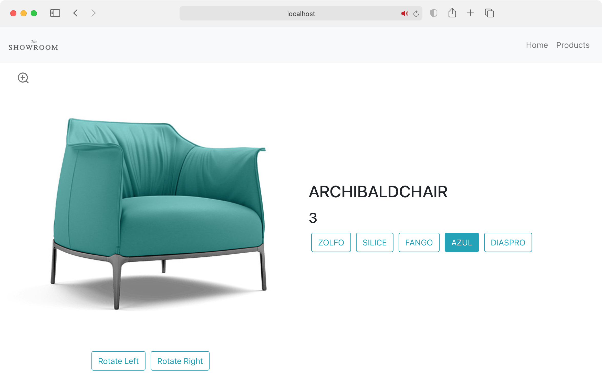

# The Showroom - Demo E-Commerce Interior Design & Furniture Store

## About

This project is a React application that mimicks a furniture/interior design webshop.

### Notable features

- Slider for navigating through product images for a 3D perspective
- Zoom in to 4K image resolution
- Real-time customisation based on product properties

### Used technologies and libraries

- React.JS
- react-router-dom
- Typescript
- Bootstrap
- React Icons

## Guidelines for running the app

### `yarn`
Installs all the required dependencies.

### `yarn start`

Runs the app in the development mode.\
Open [http://localhost:3000](http://localhost:3000) to view it in the browser.

The page will reload if you make edits.\
You will also see any lint errors in the console.
